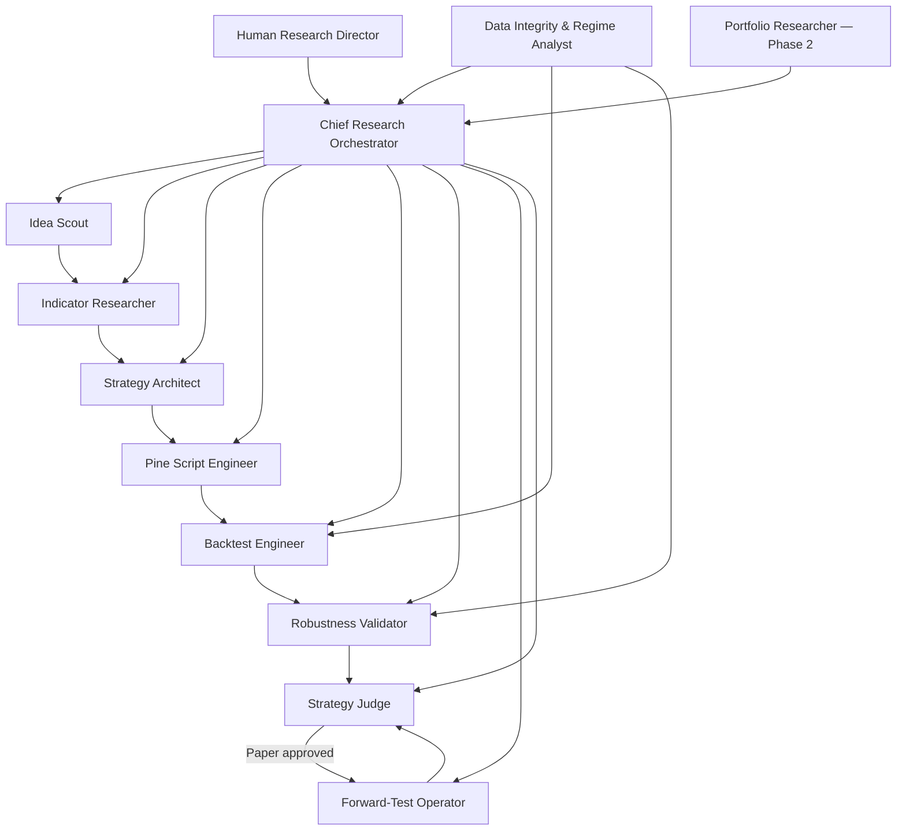
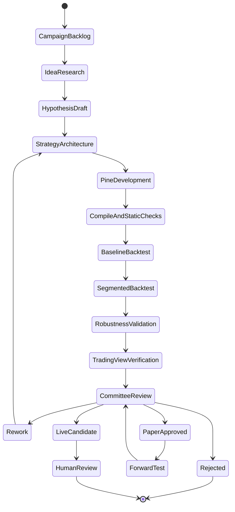
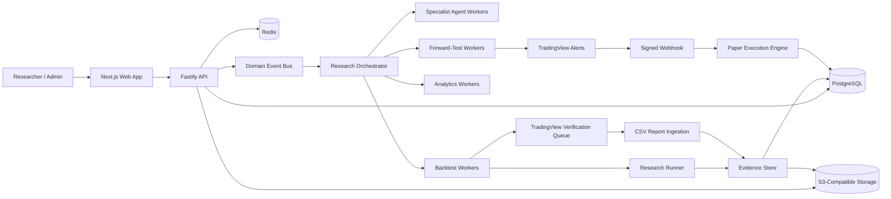

# ARF-OS

## AI Research Hedge Fund Operating System

**A multi-agent operating system for discovering, developing, testing, rejecting, forward-testing, and cataloguing systematic trading strategies.**

> **Project status:** Evidence-registry slice built and deployed · Local Pine runner: first vertical slice built · forward testing and validation lab not started  
> **Strategy language:** Pine Script® v6  
> **Primary stack:** TypeScript · Next.js · Fastify · PostgreSQL · Redis · BullMQ  
> **Deployment:** Railway — see [`docs/railway-deploy.md`](./docs/railway-deploy.md)

ARF-OS turns systematic trading research into a controlled, reproducible production line.

Instead of asking one AI agent to invent a strategy, code it, optimise it, test it, and then approve its own work, ARF-OS separates the process into independent specialist lanes. Every strategy must move through a versioned research lifecycle, pass deterministic evidence gates, survive adversarial validation, and produce a complete audit trail.

The objective is not to generate attractive equity curves. The objective is to build a research system that can distinguish promising strategies from overfitted, fragile, misleading, or unreproducible ones.

> [!IMPORTANT]
> ARF-OS is initially a **strategy research and paper-validation platform**, not a regulated hedge fund, broker, investment adviser, or autonomous capital manager. Research approval is not permission to deploy live capital. No agent can grant live-trading approval.

---

## Why ARF-OS exists

Most AI trading workflows collapse several incompatible responsibilities into one agent:

- Find an idea
- Choose indicators
- Design the rules
- Write the code
- Optimise the parameters
- Backtest the result
- Decide whether the strategy is good

That structure creates predictable failure modes. The same agent that created the strategy becomes emotionally and statistically invested in proving it works. It can silently change the hypothesis, overfit protected data, ignore failed tests, or promote a strategy because the final equity curve looks convincing.

ARF-OS uses the opposite model:

- **Independent specialist agents** with narrow responsibilities
- **Immutable strategy versions** and complete lineage
- **Protected validation and holdout data**
- **Deterministic promotion gates** implemented in code
- **Adversarial validation** designed to break weak strategies
- **TradingView parity testing** before paper approval
- **Forward testing without parameter changes**
- **Searchable failures**, so the system learns what not to repeat

The result is an evidence factory rather than a strategy-content generator.

---

## Core principles

### Evidence over persuasion

Agents are rewarded for producing testable evidence, finding failure, and rejecting weak strategies—not for writing confident narratives.

### Immutable versions

Any material change to strategy logic, parameters, market, timeframe, costs, execution assumptions, or risk settings creates a new `StrategyVersion`. Previous results are never overwritten.

### Separation of duties

The agent that creates or optimises a strategy cannot be its sole validator or approver. Validation and judgement are independent lanes.

### Protected data

In-sample, validation, out-of-sample, final holdout, and forward-test data have different access rules. Once protected results influence a redesign, they are no longer considered untouched for the new version.

### Reproducibility

Every result must be reproducible from its code hash, strategy definition, dataset identity, symbol, timeframe, date range, costs, position sizing, runner version, parameters, and execution assumptions.

### Kill weak ideas early

Cheap tests run first. Compilation, causality, repainting, minimum-trade, and cost-sensitivity checks should eliminate weak candidates before expensive robustness and forward testing.

### Models recommend; software governs

Prompts guide agent behaviour. They do not control permissions, lifecycle transitions, budgets, protected-data access, or promotion gates. Those rules live in deterministic application code.

---

## Agent organisation



### Chief Research Orchestrator

Owns the campaign plan, delegates work, validates handoffs, controls budgets, applies workflow policy, protects holdout data, and assembles the final evidence bundle. It cannot rewrite specialist evidence or grant live-capital approval.

### Idea Scout

Searches academic research, open-source strategies, market structure, trader observations, cross-market behaviour, and known anomalies. It converts vague ideas into falsifiable `IdeaCard` documents with mechanisms, assumptions, failure conditions, and research costs.

### Indicator Researcher

Investigates candidate indicators and features. It evaluates causality, lag, scaling, parameter sensitivity, redundancy, repainting risk, market suitability, and whether an indicator adds information beyond simpler alternatives.

### Strategy Architect

Turns an approved hypothesis into deterministic entry, exit, filter, sizing, and risk rules. It produces the Strategy Definition Language document before implementation begins.

### Pine Script Engineer

Implements the strategy in Pine Script v6 using the project’s coding standard. The role owns code clarity, determinism, alert payloads, metadata, static checks, and anti-repainting safeguards—not profitability.

### Backtest Engineer

Creates reproducible test plans, runs the segmented historical tests, applies realistic costs, records all assumptions, reconstructs trades and equity, and produces structured backtest evidence.

### Robustness Validator

Operates adversarially. It tries to destroy the strategy through neighbouring-parameter tests, cost stress, delay stress, regime analysis, symbol transfer, timeframe perturbation, walk-forward testing, and overfitting diagnostics.

### Forward-Test Operator

Deploys frozen strategy versions into paper environments, monitors signed TradingView alerts, simulates execution, reconciles expected and observed behaviour, and reports implementation drift. It cannot tune the active version.

### Strategy Judge

Reviews the complete evidence bundle—including failures, dissent, data-quality warnings, and forward-test drift—and issues an audited decision such as `REJECT`, `REWORK_WITH_NEW_VERSION`, `RESEARCH_APPROVED`, or `PAPER_APPROVED`.

### Data Integrity and Market-Regime Analyst

Validates datasets, sessions, timezones, gaps, symbol mappings, contract changes, look-ahead risk, and regime labels. This support lane can block testing when the underlying evidence is unreliable.

### Portfolio Researcher

A Phase 2 role that evaluates correlation, overlapping exposures, capacity, concentration, and portfolio contribution. It does not rescue weak standalone strategies through portfolio construction.

Full role definitions and prompts are available in [`SPECIALIST_AGENT_PROMPTS.md`](./SPECIALIST_AGENT_PROMPTS.md).

---

## Research lifecycle



Each transition records:

- Previous and next state
- Strategy and version identity
- Actor or agent
- Policy version
- Evidence references
- Decision reason
- Timestamp
- Human override, where applicable

No stage is implicit, and no worker can promote a strategy by directly editing lifecycle state.

---

## What every strategy produces

A strategy is not represented by a Pine file alone. ARF-OS creates a complete, versioned evidence pack containing:

- Source idea and citations
- Falsifiable hypothesis
- Indicator research cards
- Strategy Definition Language document
- Pine Script revision and source hash
- Market, timeframe, session, and timezone identity
- Cost, slippage, leverage, and position-sizing assumptions
- Dataset identity and checksum
- In-sample, validation, out-of-sample, and holdout segments
- TradingView report exports
- Parsed trade ledger
- Reconstructed equity and drawdown curves
- Independent metric calculations
- Parameter-sensitivity surfaces
- Walk-forward and regime results
- Robustness attacks and failures
- TradingView parity report
- Forward-test signals, paper orders, and fills
- Final committee decision
- Complete lineage and audit history

Failed strategies remain searchable. Their failure modes become research memory for future agents.

---

## Backtesting architecture

ARF-OS deliberately uses two testing paths.

### 1. Scalable research runner

A Pine-compatible research engine handles automated exploration, segmentation, parameter sweeps, stress testing, and large-scale experimentation.

### 2. TradingView verification runner

TradingView remains the final Pine compilation, behavioural-parity, and acceptance environment. For the MVP, a researcher exports Strategy Report and List of Trades CSV files, then uploads them to ARF-OS for versioned parsing and independent verification.

This boundary matters because the platform must not depend on unsupported, fragile browser automation as its core execution layer.

The system stores TradingView-reported metrics separately from independently calculated ARF-OS metrics. Parity can then be classified as:

- `PASS`
- `WARN`
- `FAIL`
- `INSUFFICIENT_DATA`

---

## High-level architecture



### Four operating planes

- **Control plane:** Campaigns, workflow state, budgets, policies, approvals, retries, and auditing.
- **Research plane:** Specialist agents, structured outputs, citations, assumptions, objections, and handoffs.
- **Test plane:** Pine revisions, historical runs, TradingView ingestion, metrics, validation, and forward simulation.
- **Observation plane:** Dashboards, equity curves, drawdowns, alerts, agent performance, system health, and audit history.

---

## Frontend product

The web application is designed as a research operating console rather than a generic chatbot.

### Research Command Centre

Shows active campaigns, lane status, queue depth, budget consumption, blocked tasks, recent decisions, forward-test health, and strategies approaching a gate.

### Campaign Workspace

Displays the campaign objective, universe, constraints, acceptance policy, agent task graph, evidence produced, costs, and current bottlenecks.

### Strategy Library

A searchable registry of every strategy and version, including status, market, timeframe, family, evidence score, drawdown, profit factor, robustness grade, forward-test status, similarity, and lineage.

### Strategy Detail

The canonical research page for a strategy version. It contains:

- Equity and drawdown curves
- Trade ledger
- Monthly returns
- Segment comparison
- Parameter sensitivity
- Regime performance
- Cost and delay stress
- TradingView parity
- Pine source and manifest
- Agent objections
- Forward-test drift
- Decision history
- Version lineage

### TradingView Verification Queue

Guides a researcher through running the exact Pine revision and settings in TradingView, then validates and ingests the resulting exports.

### Validation Lab

Presents adversarial tests, robustness surfaces, instability warnings, data-snooping risk, and the validator’s recommendation.

### Investment Committee Queue

Shows decision-ready evidence bundles without hiding failures or dissent. Human reviewers can approve paper testing, reject a version, or request a new version with explicit reasons.

### Agent Practice Arena

Allows each specialist lane to train on blind benchmark tasks. Production prompts can only change after benchmark improvement, regression checks, and approval.

---

## Technology stack

| Layer | Technology |
|---|---|
| Monorepo | pnpm workspaces + Turborepo |
| Language | TypeScript |
| Web | Next.js App Router |
| API | Fastify |
| Database | PostgreSQL + Drizzle ORM |
| Queues | Redis + BullMQ |
| Contracts | Zod + JSON Schema |
| Authentication | Clerk |
| Object storage | S3-compatible storage |
| Testing | Vitest + Playwright |
| Observability | OpenTelemetry-compatible instrumentation |
| Strategy code | Pine Script v6 |
| Deployment | Railway-compatible services |

The orchestration state machine belongs to ARF-OS. Core research governance should not be hidden inside a third-party agent framework.

---

## Intended repository structure

```text
/
├── apps/
│   ├── web/
│   ├── api/
│   ├── worker-research/
│   ├── worker-backtest/
│   ├── worker-analytics/
│   └── worker-forward/
├── packages/
│   ├── contracts/
│   ├── db/
│   ├── agent-runtime/
│   ├── workflow/
│   ├── metrics/
│   ├── pine/
│   ├── backtest-sdk/
│   ├── event-bus/
│   ├── auth/
│   ├── observability/
│   └── ui/
├── pine/
│   ├── boilerplate/
│   ├── libraries/
│   ├── fixtures/
│   └── generated/
├── schemas/
├── docs/
│   └── adr/
├── infra/
├── AI_RESEARCH_HEDGE_FUND_SPEC.md
├── LEADER_AGENT_SYSTEM_PROMPT.md
├── SPECIALIST_AGENT_PROMPTS.md
├── CLAUDE_CODE_BUILD_PROMPT.md
├── CLAUDE.md
└── README.md
```

---

## Specification pack

| File | Purpose |
|---|---|
| [`AI_RESEARCH_HEDGE_FUND_SPEC.md`](./AI_RESEARCH_HEDGE_FUND_SPEC.md) | Full product, agent, backend, frontend, data, testing, governance, and deployment specification |
| [`LEADER_AGENT_SYSTEM_PROMPT.md`](./LEADER_AGENT_SYSTEM_PROMPT.md) | System prompt for the Chief Research Orchestrator |
| [`SPECIALIST_AGENT_PROMPTS.md`](./SPECIALIST_AGENT_PROMPTS.md) | Individual prompts for all specialist and support lanes |
| [`CLAUDE_CODE_BUILD_PROMPT.md`](./CLAUDE_CODE_BUILD_PROMPT.md) | Build prompt for implementing the first production-quality vertical slice |
| [`CLAUDE.md`](./CLAUDE.md) | Repository-level engineering policy and non-negotiable implementation rules |
| [`schemas/strategy-definition.schema.json`](./schemas/strategy-definition.schema.json) | Initial Strategy Definition Language schema |
| [`schemas/agent-handoff.schema.json`](./schemas/agent-handoff.schema.json) | Typed contract for agent-to-agent handoffs |
| [`schemas/signal-event.schema.json`](./schemas/signal-event.schema.json) | TradingView forward-test signal-event schema |

### Recommended reading order

1. `README.md`
2. `CLAUDE.md`
3. `AI_RESEARCH_HEDGE_FUND_SPEC.md`
4. `LEADER_AGENT_SYSTEM_PROMPT.md`
5. `SPECIALIST_AGENT_PROMPTS.md`
6. `schemas/*`
7. `CLAUDE_CODE_BUILD_PROMPT.md`

---

## Implementation documentation

The files above describe the intended system. These describe what is actually
built and how to run it.

| Document | Purpose |
|---|---|
| [`docs/local-setup.md`](./docs/local-setup.md) | Getting it running locally, including Clerk and object storage |
| [`docs/railway-deploy.md`](./docs/railway-deploy.md) | Deploying every service to Railway, and what's still manual |
| [`docs/architecture.md`](./docs/architecture.md) | Runtime shape, the evidence chain, and design rules |
| [`docs/database.md`](./docs/database.md) | Schema, transactional boundaries, migrations |
| [`docs/report-parsers.md`](./docs/report-parsers.md) | TradingView CSV parsing, locale handling, fixtures |
| [`docs/api-examples.md`](./docs/api-examples.md) | Worked `curl` examples for every endpoint |
| [`docs/troubleshooting.md`](./docs/troubleshooting.md) | Failures actually encountered, and what they mean |

### Architecture decisions

| ADR | Decision |
|---|---|
| [0001](./docs/adr/0001-queue-technology.md) | Redis + BullMQ with a transactional outbox |
| [0002](./docs/adr/0002-object-storage.md) | S3-compatible storage with presigned uploads |
| [0003](./docs/adr/0003-workflow-engine.md) | A first-party state machine, not a framework |
| [0004](./docs/adr/0004-tradingview-verification.md) | Human-assisted verification, not browser automation |

### Quick start

```bash
pnpm install
docker compose -f infra/docker/docker-compose.yml up -d
pnpm db:migrate
pnpm dev
```

Full instructions, including the Clerk and object-storage configuration this
needs, are in [`docs/local-setup.md`](./docs/local-setup.md).

---

## First implementation milestone

The first vertical slice should prove the full evidence chain before autonomous scale is added.

An authenticated user must be able to:

1. Create an organisation-scoped research campaign.
2. Create or ingest a structured Idea Card.
3. Create a Strategy and immutable Strategy Version.
4. Store and validate a Strategy Definition Language document.
5. Store an immutable Pine Script v6 revision and manifest.
6. Create a TradingView verification task.
7. Upload TradingView Performance Summary and List of Trades CSV files.
8. Preserve and checksum the raw reports.
9. Parse the trade ledger and reconstruct equity and drawdown.
10. Calculate core metrics independently.
11. Compare ARF-OS results with TradingView-reported results.
12. Display Campaign, Strategy Library, and Strategy Detail screens.
13. Create an audited `REJECT`, `REWORK_WITH_NEW_VERSION`, or `PAPER_APPROVED` decision.
14. Show complete artefact identity, lineage, and audit history.

This milestone validates the hardest foundations: contracts, versioning, ingestion, evidence, workflow authority, parity, and user experience.

---

## Current development status

| Area | Status |
|---|---|
| Product and engineering specification | Complete |
| Agent hierarchy and role definitions | Complete |
| Leader and specialist prompts | Complete |
| Initial JSON schemas | Complete |
| Repository engineering policy | Complete |
| MVP vertical-slice build prompt | Complete |
| Application monorepo | Built — 6 apps, 11 packages |
| Contracts, database, migrations | Built |
| Auth and organisation boundary | Built (Clerk, organisation-scoped) |
| Workflow engine and audit | Built |
| Strategy registry | Built (immutable versions, lineage, SDL, Pine revisions) |
| Object storage and presigned uploads | Built (S3-compatible) |
| TradingView CSV ingestion | Built (both export variants, versioned parsers) |
| Independent metrics, equity, drawdown, parity | Built |
| API endpoints | Built (campaigns, strategies, verifications, backtest runs, dataset versions, decisions, audit, trades/equity/drawdown/metrics/parity reads) |
| Ingestion chain | Built — upload → ledger → equity/drawdown → metrics → parity, driven by the outbox |
| Frontend screens | Built — minimal, unstyled. Command Centre, Strategy Library, Campaign/Strategy/Backtest-run/Verification detail, Backtest Lab (launch a LOCAL_RUNNER run against a picked dataset). No Strategy Library filters yet (state/market/timeframe/parity); no equity/drawdown charts (evidence tables only) |
| Workers and transactional outbox | Built (relay, analytics; research on a fixture provider) |
| Multi-agent runtime | Partial — provider port and one IDEA_SCOUT path |
| Local Pine runner (`backtest-sdk`) | First vertical slice built — executes SDL signal expressions (not generated Pine source) against a seeded OHLCV dataset, launchable from the UI (Backtest Lab) as well as the API; see [ADR 0005](docs/adr/0005-local-pine-runner.md) for scope and honest capability gaps |
| Forward-test paper engine | Not started |
| Validation lab, practice arena, portfolio research | Not started |
| Live execution | Intentionally out of scope |

### Verification status

Everything above was exercised against real infrastructure, not mocks:
Postgres and Redis via Docker, an S3-compatible bucket, and a live Clerk
instance.

- 161 unit tests, 58 integration tests, 3 end-to-end tests
- The analytics chain was driven end to end — outbox row → relay → BullMQ →
  worker → Postgres — against a trade ledger whose metrics were hand-calculated
  first; every persisted value matched

### Known limitations

Honest gaps in what is built, beyond the "not started" rows above:

- **Organisation provisioning is manual.** Linking a Clerk organisation to a
  local one needs a one-off SQL insert ([local setup](docs/local-setup.md)).
- **Browser uploads need a CORS policy on the bucket**, which must be set in
  the storage provider's dashboard. Without it the presigned `PUT` is blocked
  by the browser even though every test passes — Node's `fetch` does not
  enforce CORS, so no suite can catch it. `./scripts/verify-credentials.sh`
  issues a real preflight and fails loudly when the policy is missing; the
  required JSON is in [local setup](docs/local-setup.md).
- **Parity is only as complete as its inputs.** `parity_reports` is written
  by `worker-analytics`, comparing this run's metric snapshots against the
  figures a TradingView Performance Summary stated. It compares three
  fields — closed trade count, net profit, max drawdown — so a divergence
  outside those is invisible to it, and a verification with no parsed summary
  yields `INSUFFICIENT_DATA` rather than a verdict.
- **Per-trade fees are assumed absent, not known to be.** A TradingView
  export states one profit figure per trade and no fee breakdown, so
  normalisation records it as both `gross_pnl` and `net_pnl` with `fees` at 0.
  That means "no separate fee figure was reported". The alternative — a null
  `net_pnl` — would make every downstream metric silently compute zero closed
  trades, a wrong answer that looks like a real one. Parity is what would
  expose the assumption: a fee-inclusive summary compared against a fee-free
  ledger diverges on net profit. See `docs/architecture.md`.
- **A run's identity is trusted as supplied.** `POST /v1/backtest-runs`
  records the cost model, window, and capital the researcher states. Nothing
  verifies those match what TradingView was actually configured with; parity
  on the resulting figures is the only check.
- **Abandoned uploads are not reaped.** A presigned URL used without calling
  complete leaves an orphaned object.
- **No indexes beyond keys and unique constraints.** Query patterns are known
  but unmeasured; CLAUDE.md 9.2 says index real patterns, not speculation.
- **The frontend is functional, not designed.** Unstyled forms and tables; no
  charts, and none of the evidence-labelling rules in spec 15 are implemented
  in the UI yet.
- **The local runner executes SDL expressions, not generated Pine source**,
  and only a constrained, entirely stateless grammar of them (eight `ta.*`
  functions including `highest`/`lowest`/`atr`, historical `[n]` offsets,
  `fixed_percent` and one-time `atr_multiple` stops, optional no-target
  exits, `market_next_bar` entries, no session filtering, no nonzero tick
  slippage, **no persistent/stateful variables** — so no ratcheting trailing
  stops, no non-resetting drawdown halts). `RunnerCapabilities` states the
  limits; anything outside them fails at `compile()` rather than running
  silently wrong. See [ADR 0005](docs/adr/0005-local-pine-runner.md).
- **There is no dataset ingestion API.** `dataset_versions` exists and one
  golden fixture is seeded for tests, but uploading real OHLCV data has no
  route yet — a `LOCAL_RUNNER` backtest run can only reference a dataset
  that was inserted directly.

---

## Engineering rules

All implementation work must follow [`CLAUDE.md`](./CLAUDE.md). The most important non-negotiable rules are:

- Use strict TypeScript and validated contracts at every boundary.
- Never mutate a tested strategy version.
- Route all lifecycle transitions through the workflow package.
- Make jobs and commands idempotent.
- Preserve raw uploaded evidence by checksum.
- Keep TradingView metrics separate from independently calculated metrics.
- Audit decisions, protected-data access, overrides, uploads, and transitions.
- Do not hide hard business rules inside prompts.
- Do not make browser automation a core dependency.
- Do not add live order routing to the initial product.
- Do not use screenshots as the canonical source of backtest metrics.
- Do not optimise on forward-test results.

---

## Security and governance

ARF-OS is designed for organisation-scoped access and append-only research governance.

The production system should include:

- Role-based access control
- Explicit protected-data permissions
- Signed or tokenised TradingView webhooks
- Replay protection and signal idempotency
- Encrypted secrets
- Immutable audit events
- Object checksums and content identity
- Human approval boundaries
- Model-provider isolation
- Budget and tool-access controls per agent
- No exchange credentials in the MVP

Security issues should not be disclosed through public issues. Add a private reporting address to `SECURITY.md` before opening the repository to outside contributors.

---

## Roadmap

### Phase 1 — Evidence Registry

Build the vertical slice for campaigns, immutable strategy versions, Pine revisions, TradingView report ingestion, independent metrics, equity curves, parity, and audited paper decisions.

### Phase 2 — Research Orchestration

Add typed specialist-agent tasks, the leader-agent state machine, model-provider adapters, citations, budgets, retry policy, and evidence-bundle generation.

### Phase 3 — Robustness Lab

Add walk-forward testing, parameter-neighbourhood analysis, regime segmentation, cost and delay stress, symbol transfer, similarity detection, and overfitting diagnostics.

### Phase 4 — Forward-Test Operations

Add TradingView alert ingestion, paper execution, expected-versus-observed reconciliation, deployment health, drift monitoring, and forward evidence gates.

### Phase 5 — Practice and Evaluation

Add blind benchmark suites, agent scorecards, prompt versioning, regression evaluation, promotion controls, and research-memory retrieval.

### Phase 6 — Portfolio Research

Add exposure decomposition, strategy correlation, crowding, capacity, portfolio simulation, and marginal contribution analysis.

Live-capital execution requires a separate legal, operational, security, and risk specification and is not implied by this roadmap.

---

## Contributing

The project is currently specification-first. Contributions are most valuable when they preserve the system’s core separation of duties and improve reproducibility rather than merely increasing strategy throughput.

Before opening a pull request:

1. Read `CLAUDE.md` and the relevant specification sections.
2. Explain any architecture change in an ADR.
3. Add or update tests for workflow, contracts, parsing, or metrics.
4. Preserve backward compatibility for stored evidence where possible.
5. Run linting, type checks, unit tests, and relevant integration tests.
6. Never weaken protected-data, audit, idempotency, or versioning rules for convenience.

A formal `CONTRIBUTING.md` will be added with the application scaffold.

---

## Disclaimer

ARF-OS is research infrastructure. Historical and simulated performance does not guarantee future results. Backtests can be materially affected by data quality, execution assumptions, fees, slippage, liquidity, latency, market regime, implementation differences, and overfitting.

Nothing in this repository is financial advice, an offer to manage money, or a guarantee of profitability. Any decision to deploy capital must be made by an authorised human under appropriate legal, operational, and risk controls.

---

## Licence

Released under the MIT Licence — see [`LICENSE`](./LICENSE).

The specification pack (`AI_RESEARCH_HEDGE_FUND_SPEC.md`, `CLAUDE.md`,
`LEADER_AGENT_SYSTEM_PROMPT.md`, `SPECIALIST_AGENT_PROMPTS.md`,
`CLAUDE_CODE_BUILD_PROMPT.md`) originates from
[daviddme/AIHedgeFund](https://github.com/daviddme/AIHedgeFund) and is used
under that licence, with its copyright notice retained.
