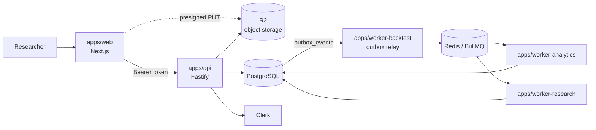
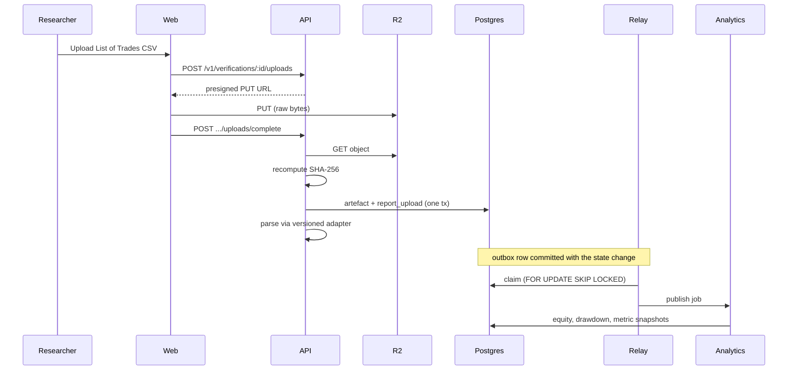

# Architecture

What exists today. For the full intended system see
[`AI_RESEARCH_HEDGE_FUND_SPEC.md`](../AI_RESEARCH_HEDGE_FUND_SPEC.md); this
document describes only what is built and running.

## Runtime shape

The dotted line matters: file bytes go from the browser straight to object
storage via a presigned URL. They never pass through the API.

## The evidence chain

The MVP's reason for existing — from a TradingView export to an audited
decision:

The checksum is recomputed server-side from the bytes fetched back out of
storage — never taken from the client (CLAUDE.md 15.1). If parsing then fails,
the raw artefact and its checksum are still persisted; a rejected parse must
not cost us the evidence.

### What of that chain is actually wired

The diagram above is the intended flow. Several links are not yet built, and
the gaps are easy to miss because `routeOutboxEvent` already maps every event
to a queue — routing exists for events nothing emits, and for queues nothing
consumes. Current state, end to end:

| Link | Producer | Consumer |
|---|---|---|
| `report_upload.parsed` → `trade-normalisation` | **none** | **none** |
| `trades.normalised` → `equity-reconstruction` | **none** | `worker-analytics` |
| `equity.reconstructed` → `metric-calculation` | `worker-analytics` | `worker-analytics` |
| `metrics.calculated` → `parity-calculation` | `worker-analytics` | `worker-analytics` |
| `strategy_version.transitioned` → `read-model-refresh` | `workflow` | **none** |
| `committee_decision.created` → `read-model-refresh` | **none** | **none** |

Two tables sit at the centre of the missing stretch: **nothing creates
`backtest_runs`, and nothing writes `trades`.** A parsed List of Trades is
discarded after its parse result is returned, so the trade ledger every
downstream handler reads is never populated by production code. The equity,
drawdown, metric, and parity handlers are complete and tested, but no
end-to-end path currently reaches them.

Closing that stretch needs three things, not just the two missing events:
persisting the parsed trades, a `trade-normalisation` consumer that writes
the ledger, and a way for a `backtest_runs` row to exist in the first place.

**A run's identity must come from the research plan, not from ingestion.**
`backtest_runs` requires `segment_kind`, `from_ts`, `to_ts`, `cost_model`,
`initial_capital`, `source_hash`, and `runner_version`, all NOT NULL. None
are derivable from a TradingView CSV. A worker that invented them to satisfy
the schema would be fabricating exactly the provenance that reproducibility
depends on (CLAUDE.md 4). The intended shape is an explicit API call that
records those fields from the researcher, with uploads attaching to an
existing run — not a run conjured during ingestion.

## Packages

| Package | Owns |
|---|---|
| `contracts` | Zod schemas, branded UUIDv7 ids, canonical hashing |
| `db` | Drizzle schema, migrations, test harness and fixtures |
| `workflow` | Lifecycle state machine, policy table, audit ([ADR 0003](adr/0003-workflow-engine.md)) |
| `metrics` | Independent decimal-precise metric calculation |
| `pine` | TradingView CSV parsers ([ADR 0004](adr/0004-tradingview-verification.md)) |
| `event-bus` | Queue definitions, outbox relay ([ADR 0001](adr/0001-queue-technology.md)) |
| `auth` | Clerk verification, RBAC, organisation resolution |
| `observability` | Structured logging with secret redaction |
| `agent-runtime` | Model provider port, IdeaCard contract, fixture provider |
| `backtest-sdk`, `ui` | Scaffolded, not yet implemented |

## Design rules that shaped the code

**Ports and adapters at every I/O boundary.** `WorkflowRepository`,
`OutboxStore`, `JobPublisher`, and `ModelProvider` are interfaces with both a
production adapter and an in-memory or fixture one. This is why the policy
matrix, the relay's batch semantics, and the agent retry logic are all
unit-testable with no infrastructure.

**Pure core, impure edge.** `evaluateTransition`, `relayOutboxBatch`,
`calculateCoreMetrics`, `compareParity`, and the CSV parsers are pure
functions. Integration tests then only need to prove persistence and
atomicity, not re-litigate business rules.

**Typed failure over exceptions.** Expected rejections — an illegal
transition, an idempotency conflict, an unparseable file — return discriminated
results. Exceptions are reserved for genuine faults.

**The organisation boundary is a join, not a filter.** Reads that touch a
strategy version join through `strategies` to check `organisation_id`, so a
caller who guesses an id gets nothing. This is enforced on the upload path
too, where object-store keys are derived from the verification row's own join
chain rather than the request body.

## What is not built

- `apps/worker-forward` — health endpoint only; no paper engine or webhook
- `backtest-sdk` — no local Pine runner
- Parity report persistence — comparison logic exists and is tested, but is
  not yet written to `parity_reports` by a worker
- Agent orchestration beyond the single IDEA_SCOUT fixture path
- Read models, SSE, practice arena, portfolio research
