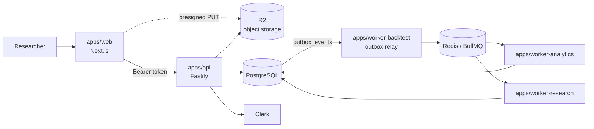
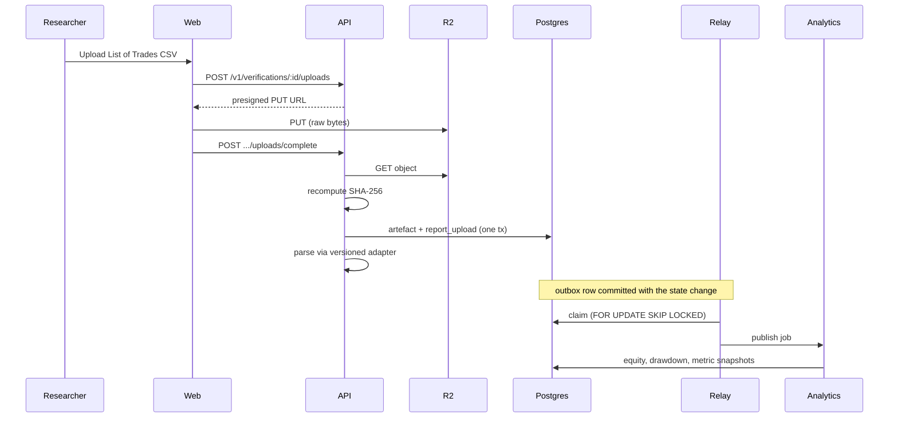

# Architecture

What exists today. For the full intended system see
[`AI_RESEARCH_HEDGE_FUND_SPEC.md`](../AI_RESEARCH_HEDGE_FUND_SPEC.md); this
document describes only what is built and running.

## Runtime shape

The dotted line matters: file bytes go from the browser straight to object
storage via a presigned URL. They never pass through the API.

## The evidence chain

The MVP's reason for existing — from a TradingView export to an audited
decision:

The checksum is recomputed server-side from the bytes fetched back out of
storage — never taken from the client (CLAUDE.md 15.1). If parsing then fails,
the raw artefact and its checksum are still persisted; a rejected parse must
not cost us the evidence.

### What of that chain is wired

`routeOutboxEvent` maps events to queues regardless of whether either end
exists, so the routing table alone does not tell you what runs. Current
state, end to end:

| Link | Producer | Consumer |
|---|---|---|
| `report_upload.parsed` → `trade-normalisation` | `api` | `worker-backtest` |
| `trades.normalised` → `equity-reconstruction` | `worker-backtest` | `worker-analytics` |
| `equity.reconstructed` → `metric-calculation` | `worker-analytics` | `worker-analytics` |
| `metrics.calculated` → `parity-calculation` | `worker-analytics` | `worker-analytics` |
| `strategy_version.transitioned` → `read-model-refresh` | `workflow` | **none** |
| `committee_decision.created` → `read-model-refresh` | **none** | **none** |

The ingestion chain runs end to end: completing a List of Trades upload
against a known run writes the ledger, which reconstructs equity and
drawdown, which calculates metrics, which produces a parity verdict. Only
the read-model refresh remains unconsumed.

### Starting the chain

Two things must be true before an upload cascades, and both are deliberate.

**A run must already exist.** `POST /v1/backtest-runs` records the market,
window, cost model, capital, and source hash a result was produced
under — every field NOT NULL, none defaulted. Reproducibility depends on
those being what the researcher actually used (CLAUDE.md 4), and none can be
recovered from a TradingView export, so a worker inventing them to satisfy
the schema would be manufacturing provenance. Run identity is a command, not
an inference.

**The upload must name that run.** `POST /v1/verifications/:id/uploads/complete`
takes an optional `backtestRunId`; supplying it is what emits
`report_upload.parsed`. Without it — or for a Performance Summary, or a
failed parse — the upload is still stored as evidence, but nothing is
emitted, because a trade row cannot exist without the run whose identity it
was produced under. The route checks the run belongs to the caller's
organisation and to the same strategy version as the verification before the
id reaches an outbox payload.

### One recorded assumption about P&L

A TradingView export states a single profit figure per trade and no
per-trade fee breakdown. Normalisation records that figure as **both**
`gross_pnl` and `net_pnl`, leaving `fees` at 0 — which means "no separate
fee figure was reported", not "there were no fees".

The alternative, leaving `net_pnl` null, would make every downstream metric
silently compute zero closed trades: a wrong answer that looks like a real
one. An explicit recorded assumption is the lesser evil, but it is an
assumption, and parity is what would expose it — a fee-inclusive summary
compared against a fee-free ledger diverges on net profit. If a runner ever
supplies real fee data, that is a new parser version and a new ledger, never
an edit to existing rows.

## Packages

| Package | Owns |
|---|---|
| `contracts` | Zod schemas, branded UUIDv7 ids, canonical hashing |
| `db` | Drizzle schema, migrations, test harness and fixtures |
| `workflow` | Lifecycle state machine, policy table, audit ([ADR 0003](adr/0003-workflow-engine.md)) |
| `metrics` | Independent decimal-precise metric calculation |
| `pine` | TradingView CSV parsers ([ADR 0004](adr/0004-tradingview-verification.md)) |
| `event-bus` | Queue definitions, outbox relay ([ADR 0001](adr/0001-queue-technology.md)) |
| `auth` | Clerk verification, RBAC, organisation resolution |
| `observability` | Structured logging with secret redaction |
| `agent-runtime` | Model provider port, IdeaCard contract, fixture provider |
| `backtest-sdk`, `ui` | Scaffolded, not yet implemented |

## Design rules that shaped the code

**Ports and adapters at every I/O boundary.** `WorkflowRepository`,
`OutboxStore`, `JobPublisher`, and `ModelProvider` are interfaces with both a
production adapter and an in-memory or fixture one. This is why the policy
matrix, the relay's batch semantics, and the agent retry logic are all
unit-testable with no infrastructure.

**Pure core, impure edge.** `evaluateTransition`, `relayOutboxBatch`,
`calculateCoreMetrics`, `compareParity`, and the CSV parsers are pure
functions. Integration tests then only need to prove persistence and
atomicity, not re-litigate business rules.

**Typed failure over exceptions.** Expected rejections — an illegal
transition, an idempotency conflict, an unparseable file — return discriminated
results. Exceptions are reserved for genuine faults.

**The organisation boundary is a join, not a filter.** Reads that touch a
strategy version join through `strategies` to check `organisation_id`, so a
caller who guesses an id gets nothing. This is enforced on the upload path
too, where object-store keys are derived from the verification row's own join
chain rather than the request body.

## What is not built

- `apps/worker-forward` — health endpoint only; no paper engine or webhook
- `backtest-sdk` — no local Pine runner
- Parity report persistence — comparison logic exists and is tested, but is
  not yet written to `parity_reports` by a worker
- Agent orchestration beyond the single IDEA_SCOUT fixture path
- Read models, SSE, practice arena, portfolio research
